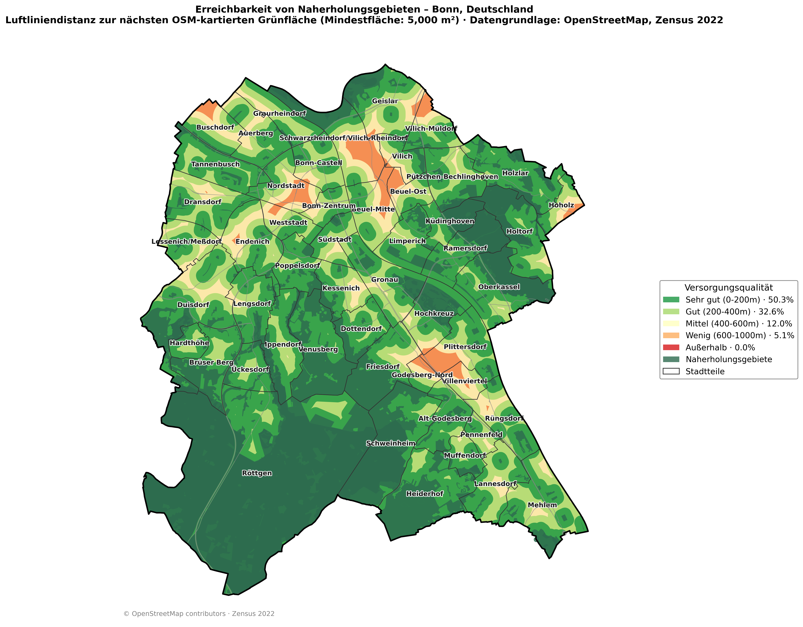
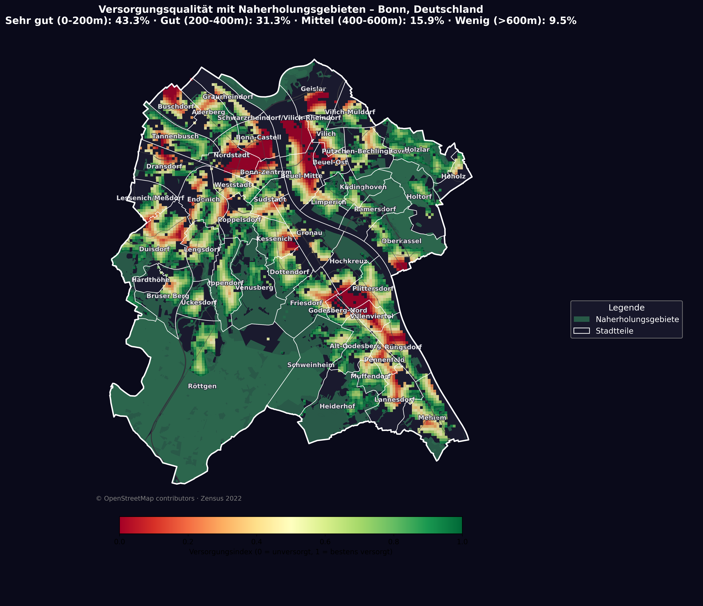

# 🌳 Grünflächen-Erreichbarkeitsanalyse

Bevölkerungsgewichtete Analyse der fußläufigen Erreichbarkeit von Naherholungsgebieten in deutschen Städten – basierend auf OpenStreetMap und Zensus 2022.

---

## 📊 Beispielergebnisse: Bonn

| Kategorie | Einwohner | Anteil |
|-----------|-----------|--------|
| Sehr gut (0–200m) | 139.028 | 43,3% |
| Gut (200–400m) | 100.726 | 31,3% |
| Mittel (400–600m) | 51.129 | 15,9% |
| Wenig (>600m) | 30.468 | 9,5% |

**Gewichteter Versorgungsindex: 55,2%**  
Niemand wohnt weiter als 1 km von einem Naherholungsgebiet entfernt.

---

## 🗺️ Karten

### Erreichbarkeitskarte


### Bevölkerungskarte


---

## 🔧 Methodik

### Versorgungsindex

Für jede Einwohnerzelle (100×100m) des Zensus 2022 wird die Luftliniendistanz 
zur nächsten Grünfläche berechnet. Daraus ergibt sich ein linearer Versorgungsindex:

- **0m** → Index 1,0 (bestens versorgt)
- **600m** → Index 0,0 (unversorgt)
- Alles dazwischen wird proportional interpoliert

### Einwohnergewichtung

Der Gesamtindex wird **einwohnergewichtet** berechnet – das bedeutet: eine 
Rasterzelle mit 50 Einwohnern hat mehr Einfluss auf das Gesamtergebnis als eine 
Zelle mit 5 Einwohnern. Der Index spiegelt damit wider wie gut die **Menschen** 
versorgt sind, nicht wie gut die **Fläche** versorgt ist.

Zum Vergleich für Bonn:
- **Flächenbasiert:** 92,7% der Stadtfläche liegt innerhalb von 500m einer Grünfläche
- **Einwohnergewichtet:** 55,2% – weil dicht besiedelte Bereiche mit schlechter 
  Versorgung stärker ins Gewicht fallen

### Naherholungsgebiete

Folgende OSM-Tags werden als Naherholungsgebiete klassifiziert 
(Mindestfläche: 5.000 m²):

| OSM-Tag | Beschreibung |
|---------|-------------|
| `leisure=park` | Öffentliche Parks |
| `leisure=garden` | Gärten (inkl. Kleingärten) |
| `leisure=nature_reserve` | Naturschutzgebiete |
| `landuse=forest` | Wälder |
| `landuse=grass` | Grünflächen und Wiesen |
| `landuse=recreation_ground` | Ausgewiesene Erholungsflächen |

### Distanzkategorien

| Kategorie | Distanz | Versorgungsindex |
|-----------|---------|-----------------|
| Sehr gut | 0–200m | 1,0–0,67 |
| Gut | 200–400m | 0,67–0,33 |
| Mittel | 400–600m | 0,33–0,0 |
| Wenig | >600m | 0,0 |

### ⚠️ Methodische Einschränkungen

- **Stadtumland wird nicht berücksichtigt** – Einwohner in Randlagen können 
  eine schlechtere Versorgung angezeigt bekommen als in der Realität, da 
  Grünflächen im direkten Umland nicht einbezogen werden
- **Nur kartierte OSM-Flächen fließen ein** – bewirtschaftete Flächen die 
  in der Realität als Naherholungsgebiet genutzt werden (z.B. Feldwege, 
  das Meßdorfer Feld in Bonn) werden nicht erfasst
- **Luftlinie statt Gehweg** – die tatsächliche Wegstrecke kann durch 
  Barrieren wie Straßen, Gleise oder Bebauung länger sein
- **OSM-Datenlage** – Vollständigkeit und Aktualität der Grünflächen 
  variiert je nach Stadt
  
---

## Verwendung

### Voraussetzungen

```bash
pip install osmnx geopandas matplotlib pandas shapely
```

### Zensus-Daten

Die Zensus-CSV wird benötigt aber nicht mitgeliefert (Dateigröße > 100 MB).

**Download:** [destatis.de](https://www.destatis.de/static/DE/zensus/gitterdaten/Zensus2022_Bevoelkerungszahl.zip)  
**Dateiname:** `Zensus2022_Bevoelkerungszahl_100m-Gitter.csv`  
**Speicherort:** `data/raw/Zensus2022_Bevoelkerungszahl_100m-Gitter.csv`

### Konfiguration

Öffne `notebooks/gruenflaechen_analyse.ipynb` und passe in **Zelle 1** an:

```python
STADT = "Bonn, Deutschland"   # beliebige deutsche Stadt
BASIS = r"C:\Pfad\zu\deinem\Projektordner"
```

Anschließend: **Kernel → Restart & Run All**

### Unterstützte Städte

Das Notebook funktioniert für alle deutschen Städte. Die Darstellung passt sich automatisch an:
- **Kreisfreie Städte** (z.B. Bonn, Dortmund, Berlin): Stadtteile bzw. Stadtbezirke werden angezeigt
- **Kreisangehörige Orte** (z.B. Pulheim): nur Stadtgrenze

> Die Qualität der Stadtteilgrenzen hängt von der OSM-Datenlage ab. In kleineren Städten können Stadtteile unvollständig eingetragen sein.

---

## 📁 Projektstruktur

```
gruenflaechen-analyse/
├── notebooks/
│   └── gruenflaechen_analyse.ipynb   # Hauptanalyse
├── outputs/
│   ├── bonn_erreichbarkeit.png       # Erreichbarkeitskarte
│   └── bonn_bevoelkerung.png         # Bevölkerungskarte
├── data/
│   └── raw/                          # Zensus-CSV hier ablegen (nicht im Repo)
└── README.md
```

---

## 🛠️ Tools & Datenquellen

| Tool / Daten | Verwendung |
|---|---|
| [OSMnx](https://osmnx.readthedocs.io) | OpenStreetMap-Daten laden |
| [GeoPandas](https://geopandas.org) | Geodatenverarbeitung |
| [Matplotlib](https://matplotlib.org) | Kartenerstellung |
| [Zensus 2022](https://www.zensus2022.de) | Bevölkerungsdaten (100m-Raster) |
| [OpenStreetMap](https://www.openstreetmap.org) | Grünflächen & Verwaltungsgrenzen |

---

## Lizenz

Dieses Projekt steht unter der [MIT Lizenz](LICENSE).  
Kartendaten © OpenStreetMap contributors · Zensus 2022 © Statistische Ämter des Bundes und der Länder
